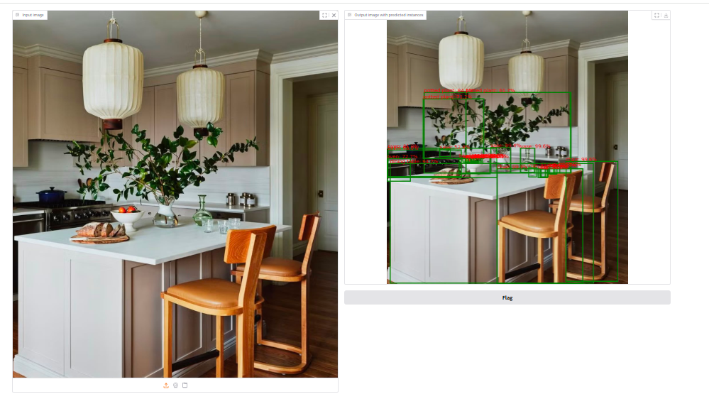
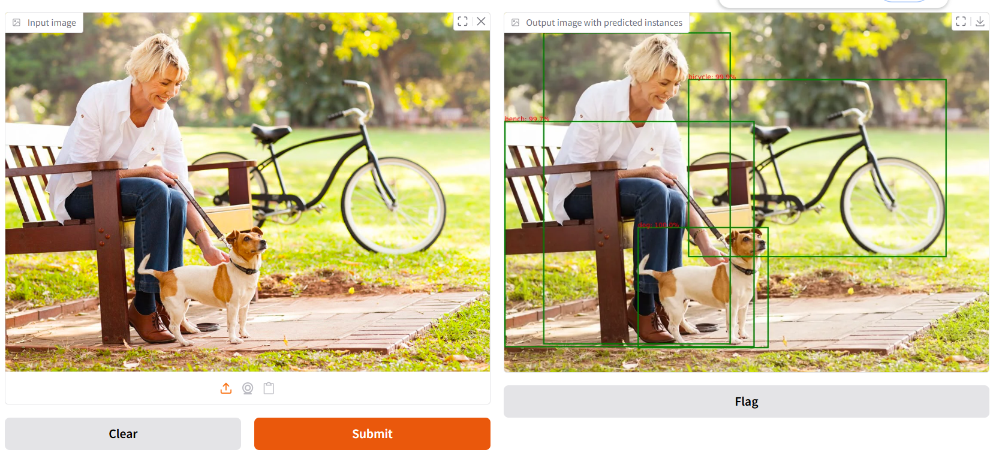
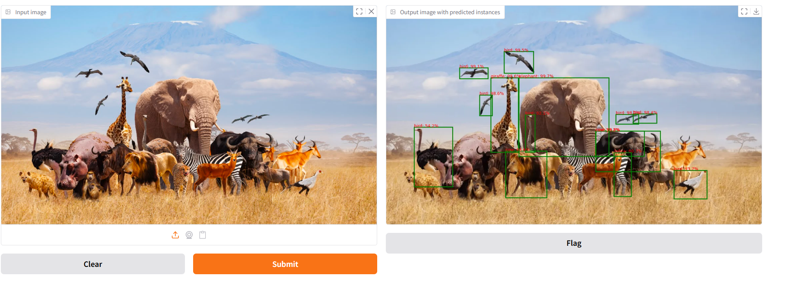

### Project Overview

This project is an object detection and voice assistant application developed using Hugging Face Transformers and Gradio.
The application detects and localizes objects in uploaded images by displaying labels, confidence scores, and bounding boxes. It also creates a natural-language summary of the detected objects and converts that summary into spoken audio.

---

### Object Detection

Object detection is a computer vision task that performs two main operations:

1. **Classification:** Identifies what objects are present in an image.
2. **Localization:** Identifies where each object is located using bounding boxes.

Unlike basic image classification, object detection can identify and locate multiple objects in the same image.

---

### Model Used

The application uses the following pretrained Hugging Face model:

```python
facebook/detr-resnet-50
```

The model is loaded using the Hugging Face pipeline:

```python
from transformers import pipeline

od_pipe = pipeline(
    "object-detection",
    "facebook/detr-resnet-50"
)
```

The model was already pretrained. Therefore, this project uses the model for inference and does not train it again.

---

### Application Workflow

The application follows these steps:

1. The user uploads an image through the Gradio interface.
2. The uploaded image is converted to a PIL image.
3. The image is passed to the Hugging Face object detection pipeline.
4. The model returns:
   - Object labels
   - Confidence scores
   - Bounding-box coordinates
5. The `render_results_in_image()` helper function draws the boxes and labels.
6. The processed image is displayed in the Gradio output area.

```text
Uploaded Image
      ↓
Hugging Face Object Detection Pipeline
      ↓
Labels + Confidence Scores + Bounding Boxes
      ↓
Helper Function
      ↓
Processed Image Displayed in Gradio
```
---

### Gradio Application

The prediction function sends the uploaded image to the object detection model and then creates the processed output image.

```python
def get_pipeline_prediction(pil_image):

    pipeline_output = od_pipe(pil_image)

    processed_image = render_results_in_image(
        pil_image,
        pipeline_output
    )

    return processed_image
```

The function is connected to the Gradio interface:

```python
demo = gr.Interface(
    fn=get_pipeline_prediction,

    inputs=gr.Image(
        label="Input image",
        type="pil"
    ),

    outputs=gr.Image(
        label="Output image with predicted instances",
        type="pil"
    )
)

demo.launch(share=True)
```

The input area accepts an uploaded image, and the output area displays the same image with detected objects, bounding boxes, labels, and confidence scores.

---

### Helper File

The project includes a supporting Python file named:

```text
helper.py
```

The helper file contains the `render_results_in_image()` function.

This function:

- Reads each prediction returned by the model
- Extracts the bounding-box coordinates
- Calculates the width and height of each box
- Draws a rectangle around each detected object
- Displays the object label
- Displays the prediction confidence percentage

The notebook imports the helper function using:

```python
from helper import load_image_from_url, render_results_in_image
```
---

### Technologies Used

- **Programming Language:** Python 3
- **Computer Vision Task:** Object Detection
- **AI Model:** Facebook DETR with ResNet-50 (`facebook/detr-resnet-50`)
- **Model Platform:** Hugging Face Transformers
- **Text-to-Speech:** Hugging Face text-to-speech/audio pipeline
- **Web Interface:** Gradio
- **Libraries:** PyTorch, Transformers, Gradio, Pillow, Matplotlib, NumPy, and TIMM
- **Helper Module:** `helper.py` for drawing bounding boxes, labels, confidence scores, and generating a text summary
---
### Voice Assistant

The project also includes a voice assistant feature.
After the model detects the objects in an image, the detected labels are counted and converted into a natural-language sentence. The sentence is then processed by a Hugging Face text-to-speech model to generate spoken audio.
The voice feature was successfully tested using one image in the notebook.

### Project Files

| File | Description |
|---|---|
| `Object_detection.ipynb` | Main notebook containing the model, object detection process, and Gradio application |
| `helper.py` | Supporting functions for drawing bounding boxes, labels, and confidence scores |
| `README.md` | Project documentation |
| `Image1_Kitchen.png` | Gradio application result for the first test image |
| `Image2_Person.png` | Gradio application result for the second test image |
| `Image3_Animals.png` | Gradio application result for the third test image |

---

### Application Testing

The same Gradio application was tested using three different images.

Each screenshot shows:

- The original uploaded image
- The processed output image
- Detected object labels
- Bounding boxes
- Confidence scores

#### Test 1

The first image was uploaded and processed through the Gradio application.



---

#### Test 2

The second image was uploaded and processed using the same application.



---

#### Test 3

The third image was uploaded and processed using the same application.



---

#### How to Run the Application

### 1. Download or clone the repository

Download all project files and keep the notebook and `helper.py` in the same folder.

### 2. Install the required libraries

```python
pip install transformers gradio torch torchvision timm pillow matplotlib inflect
```

### 3. Open the notebook

Open:

```text
Object_detection.ipynb
```

Run the notebook cells in order.

### 4. Launch the Gradio interface

Run:

```python
demo.launch(share=True)
```

Gradio will provide a local link and may also provide a temporary public link.

### 5. Test an image

Open the Gradio interface, upload an image, and submit it for object detection.

---

### Results

The application successfully processed three different images.

For each image, the pretrained model:

- Identified recognizable objects
- Assigned object labels
- Generated confidence scores
- Located the objects using bounding boxes
- Displayed the results through the Gradio interface

---

### Conclusion

This project successfully demonstrates how a pretrained Hugging Face computer vision model can be integrated with Gradio.

The completed application provides an easy-to-use interface where users can upload images and receive object detection results without manually running individual prediction commands.

The project also demonstrates the use of supporting Python functions to convert raw model predictions into a clear visual output containing object names, confidence scores, and bounding boxes.
